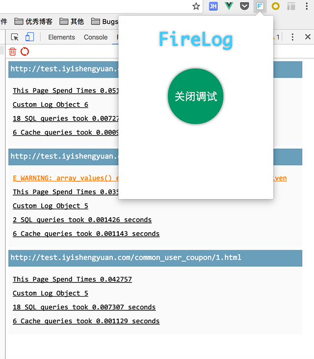
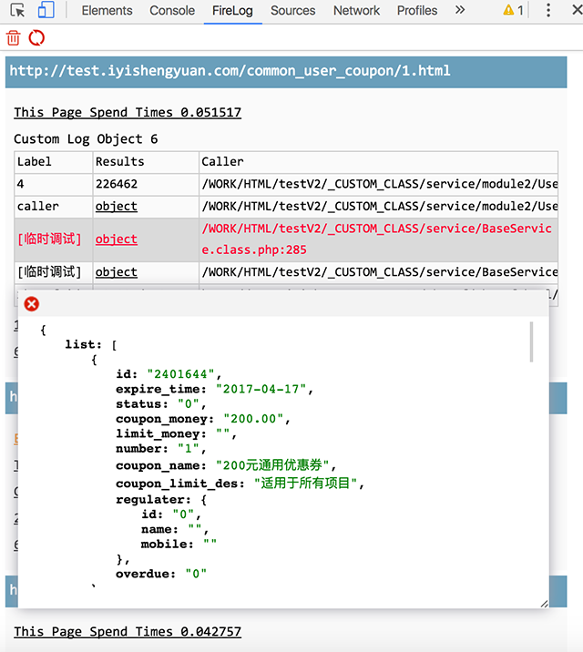

## FireLog

类似于FireBug的FirePHP插件，方便开发者调试PHP应用。

FirePHP的原理是，在响应头中加入需要打印的LOG信息，然后在FirePHP中，进行解析即可。FirePHP因为一些原因，使用不了了，这里写了一个Chrome的插件。

## Notes

1. 目前chrome版本有一个问题，Response Header最大不能超过256K，[看这里](https://cs.chromium.org/chromium/src/net/http/http_stream_parser.h?q=ERR_RESPONSE_HEADERS_TOO_BIG&sq=package:chromium&dr=C&l=159)。当响应超过256K时，浏览器会报错。这个暂时无法解决，只能限制输出的长度了。Firefox没有这个问题。

2. Firefox未来的插件机制在向WebExtension标准靠拢。所以，初步想法是，移植一个Firefox版本的插件来绕过这个问题。但是Firefox目前还未实现自定义DevTools Panel的API。计划是在[6月发布的版本](https://trello.com/b/PC9kB14s/webextensions-roadmap)中新增。因此，我这里，先做好，准备，到时候移植过去了。

## 截图

## License

MIT.
