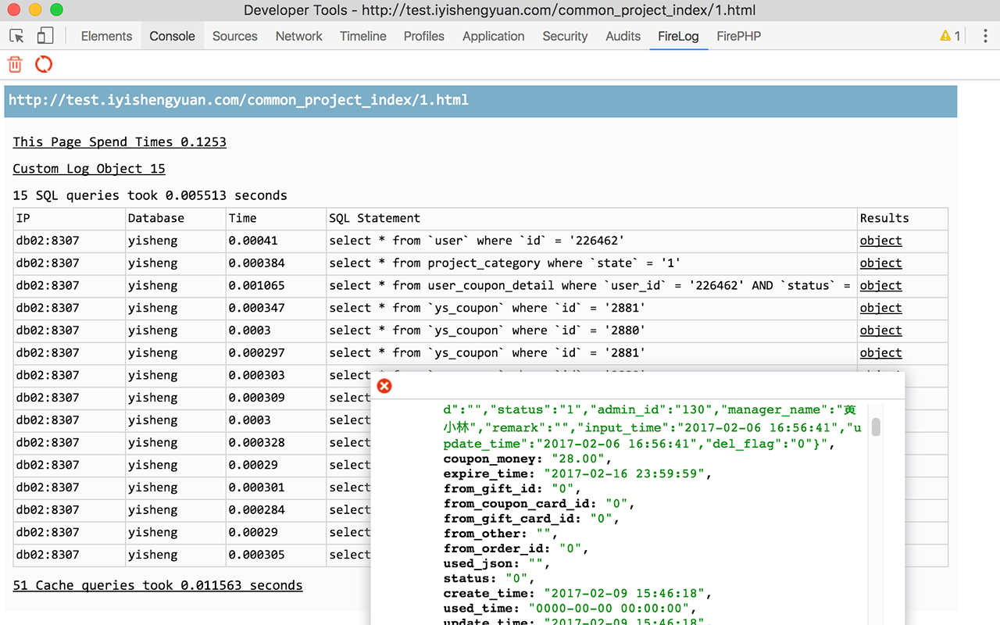

## FireLog

类似于FireBug的FirePHP插件，方便开发者调试PHP应用。

FirePHP的原理是，在响应头中加入需要打印的LOG信息，然后在FirePHP中，进行解析即可。FirePHP因为一些原因，使用不了了，这里写了一个Chrome的插件。

## 截图

## 已知问题

1. 目前对于输出的解析，并不标准。只能解析Table类型的响应。
2. 点击Object查看详情时，无法进行折叠。

## Licence

MIT.
